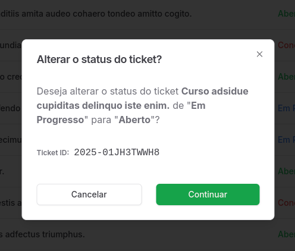

<div align="center" id="top">
  

  &#xa0;

  <!-- <a href="https://desafiotickets.netlify.app">Demo</a> -->
</div>

<h1 align="center">Desafio Tickets</h1>

<p align="center">
  

  

  

  

  </p>

<!-- Status -->

<!-- <h4 align="center">
	🚧  Desafio Tickets 🚀 Under construction...  🚧
</h4>

<hr> -->

<p align="center">
  <a href="#dart-about">About</a> &#xa0; | &#xa0;
  <a href="#sparkles-features">Features</a> &#xa0; | &#xa0;
  <a href="#rocket-technologies">Technologies</a> &#xa0; | &#xa0;
  <a href="#white_check_mark-requirements">Requirements</a> &#xa0; | &#xa0;
  <a href="#checkered_flag-starting">Starting</a> &#xa0; | &#xa0;
  <a href="#memo-license">License</a> &#xa0; | &#xa0;
  <a href="https://github.com/andrelinos" target="_blank">Author</a>
</p>

<br>

## :dart: About ##

This is a ticket management system built with Next.js, Prisma, TailwindCSS, and shadcn-ui. The main goal of this application is to streamline ticket management by enabling users to add, edit, delete, filter, and list all registered tickets. Additionally, each ticket supports adding comments to facilitate communication and tracking.

## :sparkles: Features ##

:heavy_check_mark: Add Ticket: Quickly and easily create new tickets.\
:heavy_check_mark: Edit Ticket: Update information for existing tickets.\
:heavy_check_mark: Delete Tickets: Remove tickets that are no longer needed.\
:heavy_check_mark: Filter Tickets: Easily find tickets using advanced filters.\
:heavy_check_mark: List Tickets: View all tickets in a clean and user-friendly interface.\
:heavy_check_mark: Add Comments: Attach comments to tickets for better communication and tracking.\
:heavy_check_mark: Change status Ticket on list;\

## :rocket: Technologies ##

The following tools were used in this project:

- [Next.js](https://nextjs.org/): A modern React framework for optimized web development.
- [TypeScript](https://www.typescriptlang.org/): TypeScript is a superset of JavaScript that adds static typing and advanced features for enhanced safety and developer productivity.
- [Prisma](https://www.prisma.io/): An ORM that simplifies database queries and management.
- [Tailwind CSS](https://tailwindcss.com/): A styling framework for building elegant, responsive designs.
- [shadcn/ui](https://ui.shadcn.com/): Pre-built and highly customizable UI components.

## :white_check_mark: Requirements ##

Before starting :checkered_flag:, you need to have [Git](https://git-scm.com) and [Node](https://nodejs.org/en/) installed.

## :checkered_flag: Starting ##

```bash
# Clone this project
$ git clone https://github.com/andrelinos/desafio-tickets.git

# Access
$ cd desafio-tickets

# Install dependencies
$ npm i

# Apply migrations
npx prisma migrate dev

# Create fake data
npm run prisma:seed

# Run the project
$ npm run dev

# The server will initialize in the <http://localhost:3000>
```

## Screenshots





## :memo: License ##

This project is under license from MIT. For more details, see the [LICENSE](LICENSE.md) file.

Made with :heart: by <a href="https://github.com/andrelinos" target="_blank">Andrelino Silva</a>

&#xa0;

<a href="#top">Back to top</a>
